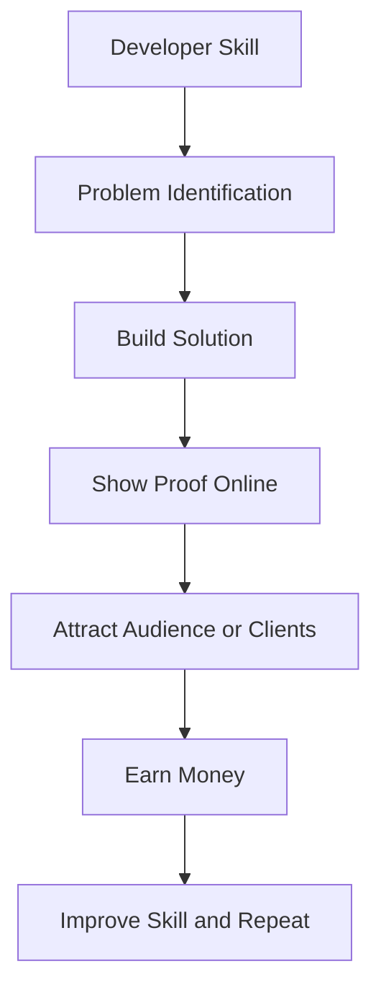

# How Developers Can Earn Online Beyond a 9–5 Job
# 开发者如何通过 9-5 工作之外的途径在线赚取收入

A developer’s income no longer has to depend only on a fixed monthly salary. A 9–5 job is still valuable. It gives stability, experience, team exposure, and real-world problem-solving skills. But if you are a developer, student, beginner, freelancer, or tech learner, you already have one powerful advantage: you can build things. You can build websites, tools, dashboards, templates, APIs, automations, SaaS products, plugins, courses, and technical content. These skills can create multiple income streams online.

开发者的收入不再仅仅依赖于固定的月薪。9-5 的工作依然很有价值，它能提供稳定性、经验、团队协作机会以及解决现实问题的能力。但如果你是一名开发者、学生、初学者、自由职业者或技术学习者，你已经拥有了一个强大的优势：你可以创造事物。你可以构建网站、工具、仪表板、模板、API、自动化脚本、SaaS 产品、插件、课程和技术内容。这些技能可以在线创造多种收入来源。

But here is the truth: earning online is not magic. It is not about posting “I am available for work” once and waiting for clients. It is not about launching one product and expecting passive income from day one. Online earning as a developer requires skill, consistency, positioning, trust, and problem-solving. This blog will explain practical ways developers can earn beyond a 9–5 job with realistic examples, mistakes to avoid, and a step-by-step roadmap.

但事实是：在线赚钱并非魔法。它不是发一条“我接单”的动态然后坐等客户上门，也不是发布一个产品就指望从第一天起就有被动收入。作为开发者，在线赚钱需要技能、持续性、定位、信任和解决问题的能力。本博客将通过现实案例、避坑指南和分步路线图，解释开发者如何在 9-5 工作之外赚取收入。

### Why Developers Have a Strong Advantage Online
### 为什么开发者在互联网上拥有巨大优势

Developers can turn knowledge into useful assets. A designer may create visuals. A writer may create articles. A marketer may create campaigns. But a developer can create working products that solve real problems. For example:
* A job tracker for students
* A portfolio website for freelancers
* A Notion dashboard for creators
* A Chrome extension for productivity
* A SaaS tool for small businesses
* A blog platform for developers
* An automation script for social media posting

开发者可以将知识转化为有用的资产。设计师可以创作视觉作品，作家可以撰写文章，营销人员可以策划活动，但开发者可以创造出解决实际问题的实用产品。例如：
* 学生用的求职追踪器
* 自由职业者的作品集网站
* 创作者用的 Notion 仪表板
* 提高生产力的 Chrome 插件
* 小型企业的 SaaS 工具
* 开发者博客平台
* 社交媒体自动发布脚本

The internet rewards useful solutions. Developers are trained to build solutions.
互联网奖励有用的解决方案，而开发者正是受过构建解决方案训练的人。

### The Developer Online Income Flow
### 开发者在线收入流程

Before choosing any income path, understand the basic flow.
在选择任何收入路径之前，请先了解其基本流程。

This diagram shows that income starts from skill, but skill alone is not enough. You need to identify a problem, build something useful, show proof, and then monetize it. Many developers fail because they directly jump from “I know coding” to “I want money.” The missing part is proof.

该图表显示，收入始于技能，但仅有技能是不够的。你需要识别问题、构建有用的东西、展示成果，然后将其变现。许多开发者失败的原因是他们直接从“我会写代码”跳到了“我想赚钱”。缺失的环节就是“成果展示”。

### 1. Freelancing: The Fastest Practical Starting Point
### 1. 自由职业：最快且最务实的起点

Freelancing is one of the most realistic ways to earn online as a developer. You can offer services like: Landing page development, Portfolio websites, Business websites, Bug fixing, Website speed optimization, React component development, API integration, Admin dashboard development, WordPress to React migration, UI improvement.

自由职业是开发者在线赚钱最务实的方式之一。你可以提供以下服务：落地页开发、作品集网站、企业网站、Bug 修复、网站速度优化、React 组件开发、API 集成、管理后台开发、WordPress 转 React 迁移、UI 优化等。

**Real-World Example:** A local coaching institute needs a website with: Home page, Courses page, Contact form, WhatsApp button, Admin panel for adding notices. A beginner developer can build this using: React or Next.js, Tailwind CSS, Firebase/Appwrite/MongoDB, Form submission through email API. You do not need to build enterprise-level software to start earning. Small businesses need simple, working solutions.

**现实案例：** 一家当地的培训机构需要一个包含首页、课程页、联系表单、WhatsApp 按钮以及用于发布公告的管理后台的网站。初级开发者可以使用 React 或 Next.js、Tailwind CSS、Firebase/Appwrite/MongoDB 以及通过邮件 API 提交表单来构建它。你不需要构建企业级软件就能开始赚钱，小企业只需要简单、好用的解决方案。

### 2. Building and Selling Digital Products
### 2. 构建并销售数字产品

Digital products are powerful because you build once and sell multiple times. For developers, digital products can include: Website templates, React components, Admin dashboard templates, Notion templates, Resume templates for developers, UI kits, SaaS starter kits, API boilerplates, Prompt kits, Coding interview sheets.

数字产品非常强大，因为你可以“一次构建，多次销售”。对于开发者来说，数字产品可以包括：网站模板、React 组件、管理后台模板、Notion 模板、开发者简历模板、UI 套件、SaaS 启动套件、API 样板代码、提示词（Prompt）套件、编程面试题库等。

**Example Product Ideas:**
**产品创意示例：**

| Product Type | Target User | Example Price | Difficulty |
| :--- | :--- | :--- | :--- |
| Portfolio template | Students and freshers | ₹199–₹999 | Beginner |
| Admin dashboard | Startup founders | ₹999–₹4999 | Intermediate |
| SaaS starter kit | Indie hackers | ₹2999–₹9999 | Advanced |
| Resume kit | Job seekers | ₹199–₹499 | Beginner |
| UI component pack | Frontend developers | ₹499–₹1999 | Intermediate |

| 产品类型 | 目标用户 | 参考价格 | 难度 |
| :--- | :--- | :--- | :--- |
| 作品集模板 | 学生与应届生 | ₹199–₹999 | 初级 |
| 管理后台 | 初创公司创始人 | ₹999–₹4999 | 中级 |
| SaaS 启动套件 | 独立开发者 | ₹2999–₹9999 | 高级 |
| 简历套件 | 求职者 | ₹199–₹499 | 初级 |
| UI 组件包 | 前端开发者 | ₹499–₹1999 | 中级 |

**Best Use Case:** Suppose you create a “Developer Portfolio Template” using Next.js and Tailwind CSS. It can include: Home section, About section, Skills section, Projects section, Blog section, Contact form, SEO setup, Responsive design. Students and freshers often struggle to create a good portfolio. Your product solves that problem.

**最佳应用场景：** 假设你使用 Next.js 和 Tailwind CSS 创建了一个“开发者作品集模板”。它可以包含：首页、关于我、技能展示、项目展示、博客板块、联系表单、SEO 设置以及响应式设计。学生和应届生往往难以做出好的作品集，而你的产品正好解决了这个问题。